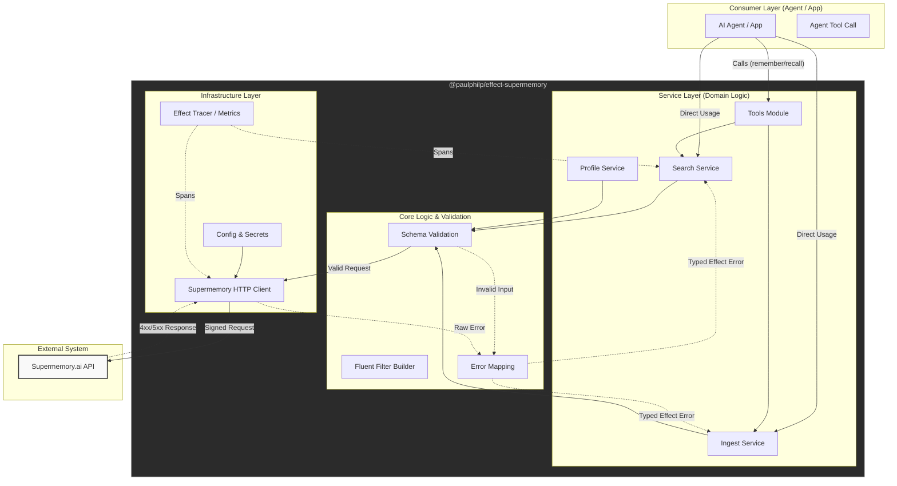

## `effect-supermemory` Architecture

This diagram illustrates the system flow from the consumer (Agent or App) down to the external Supermemory API, highlighting the role of the Effect runtime in managing the "untrusted" boundaries.

### Key Architectural Insights from Diagram:

1.  **The "Schema Firewall":** Note how `Schema Validation` sits between the Service Layer and the Client. Nothing leaves the library without being validated against the domain model. This prevents sending garbage to the API.
2.  **Typed Error Propagation:** The `Error Mapping` module is critical. It converts raw HTTP errors (429, 500) into actionable Effect errors (`SupermemoryRateLimitError`), which bubble up to the agent for intelligent handling (e.g., "I should wait before retrying").
3.  **Tool Abstraction:** The `Tools` module is a distinct adapter. It simplifies the complex `Search Service` into a format an LLM can understand ("Here is a function called `search_memory`"), bridging the gap between code and cognition.
4.  **Observability First:** Telemetry isn't a sidecar; it's woven into the Client and Search layers, ensuring that every memory operation is traceable in a distributed trace.